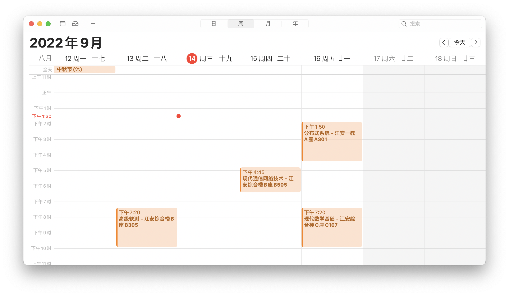

# 生成课表ics文件

### 💡 如何使用

1. 将相关信息录入 `class.txt` 中
2. 执行 `python ClassSchedule.py` 
3. 打开生成的 `class.ics` 

### 📒 建议

+ 课程名称使用简称
+ 导入日程时新建日历，以便后续更改

### ⚠️ 注意

+ 本程序只在 `Macbook` 上测试过
+ 如果您是 `Windows` 和 `iPhone` 用户，需要通过 `iPhone` 自带的 `邮件 App` 接收带有 `ics` 文件的邮件才可以直接导入系统自带的 `日历 App`   

